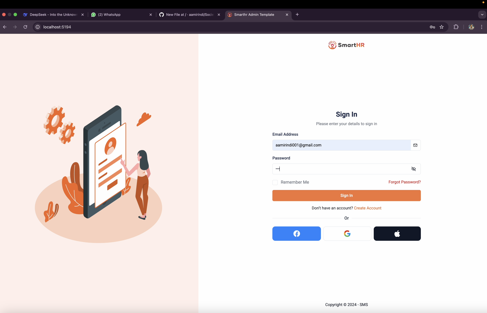
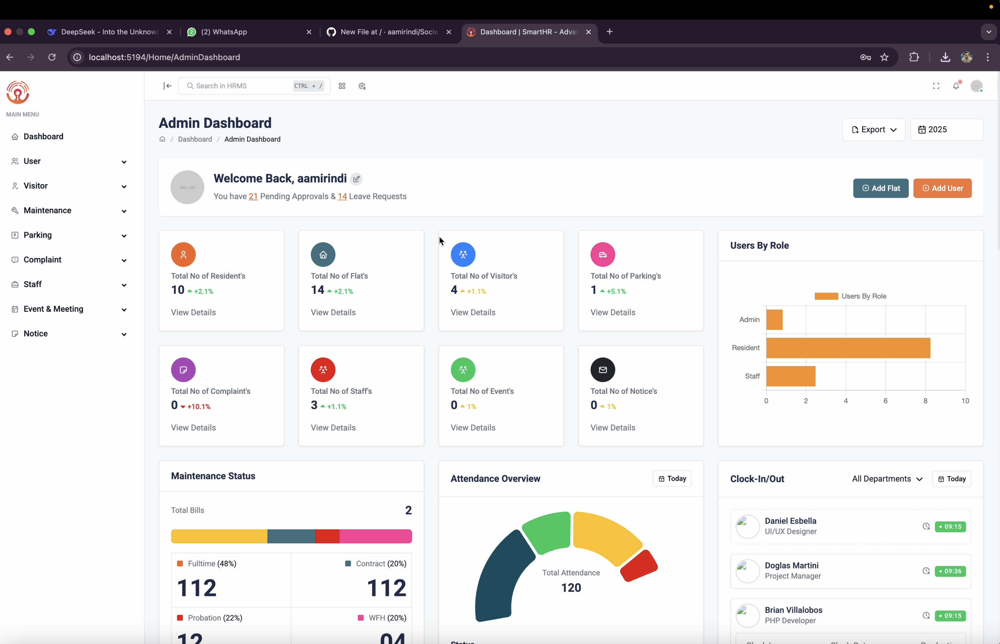
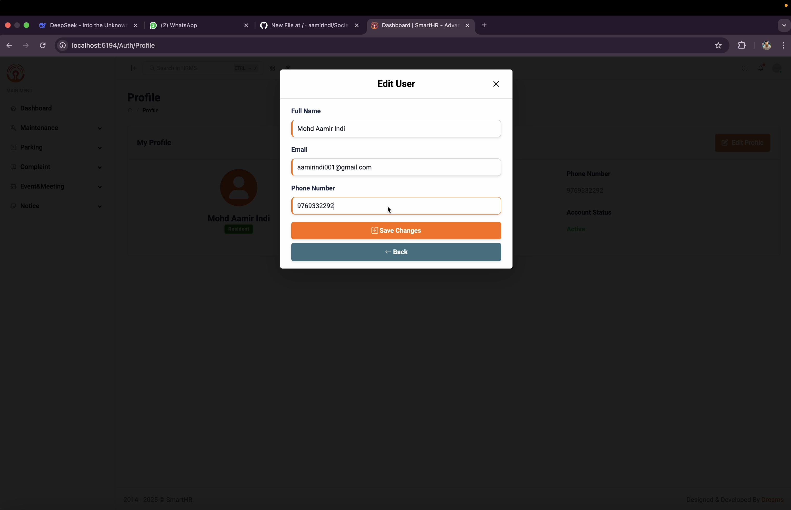
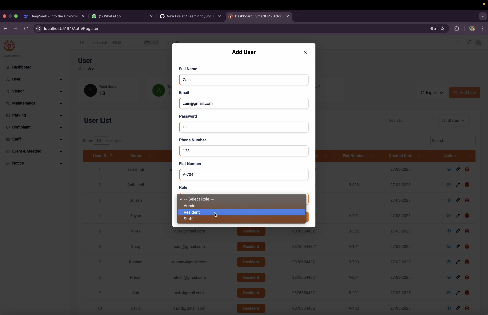
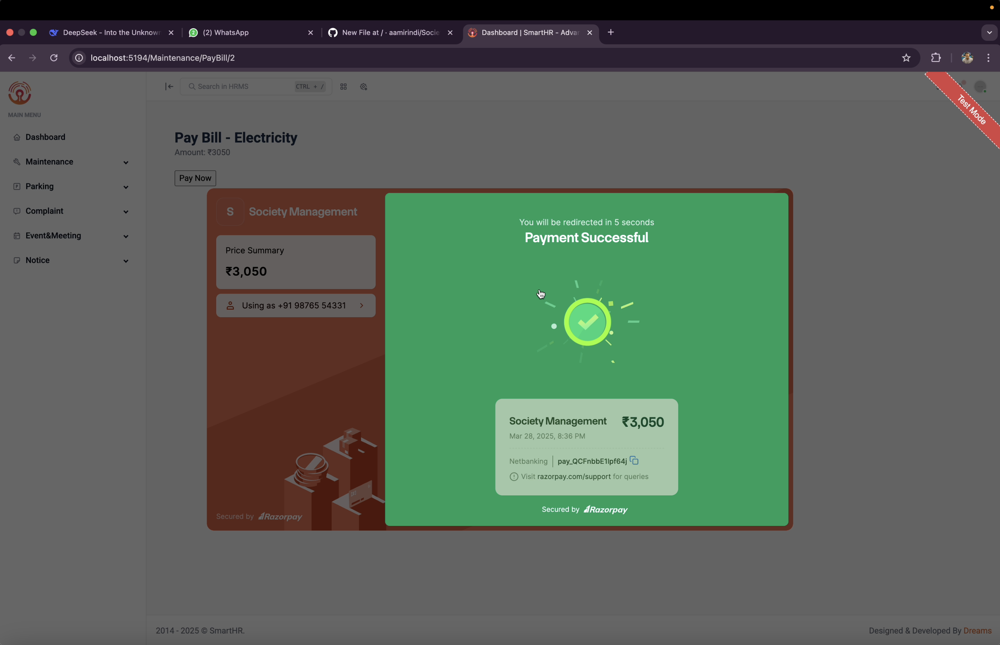
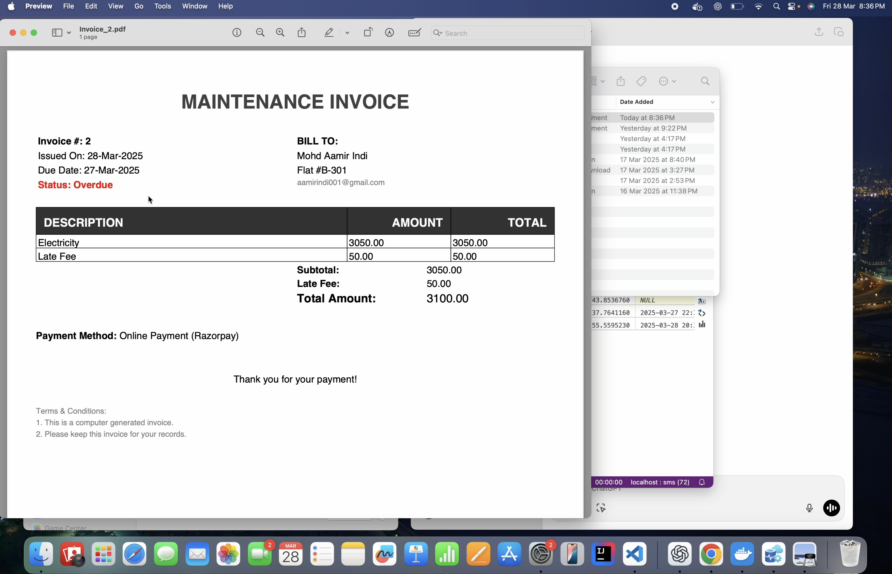

# 🏘️ Society Management System


A comprehensive **Society Management System** built with ASP.NET Core MVC and SQL Server, featuring role-based access control (Admin, Resident, Staff) with complete module coverage for modern residential societies.

## ✨ Features

### 🔑 Authentication
- **3-Tier Role System** (Admin/Resident/Staff)
- **Google Login Integration**
- **OTP Verification** for visitors
- **Secure session management**

### 🏗️ Core Modules
| Module                | Description                                  |
|-----------------------|----------------------------------------------|
| **User Management**   | Complete CRUD for all user types             |
| **Visitor System**    | OTP-based entry/exit tracking               |
| **Billing**           | Automated bill generation + payment tracking |
| **Complaints**        | Ticket system with status workflow          |
| **Events & Meetings** | Calendar with RSVP functionality            |
| **Staff Assignment**  | Duty scheduling + task management           |
| **Notices**           | Announcements with targeted distribution    |
| **Flat Management**   | Resident allocation + maintenance records   |
| **Parking**           | Slot allocation + vehicle registration      |

## 🖥️ Technology Stack

### Backend
- ASP.NET Core MVC 6.0
- Entity Framework Core (Code-First)
- SQL Server 2019+
- Dapper for complex queries
- AutoMapper for DTOs

### Frontend
- Razor Pages + Bootstrap 5
- jQuery + AJAX
- Toastr notifications
- Chart.js visualization
- FullCalendar integration

## 📦 Installation

```bash
# Clone repository
git clone https://github.com/aamirindi/society-management-system.git

# Navigate to project
cd society-management-system

# Restore packages
dotnet restore

# Configure database (update connection string in appsettings.json)
dotnet ef database update
```

## ⚙️ Configuration

1. Set up Google Auth:
   ```json
   "Authentication": {
     "Google": {
       "ClientId": "YOUR_CLIENT_ID",
       "ClientSecret": "YOUR_SECRET"
     }
   }
   ```

2. Configure SMS gateway for OTP:
   ```json
   "OTPSettings": {
     "AccountSID": "YOUR_SID",
     "AuthToken": "YOUR_TOKEN",
     "FromNumber": "+1234567890"
   }
   ```

## 🖼️ Screenshots
### Login Page

### Admin Panel

### Resident Profile  

### User Management

### Payment Integration

### Invoice Generation



## 📜 License

MIT License - See [LICENSE](LICENSE) for details.

## 📞 Contact

**Mohd Aamir Indi**  
📧 aamirindi@gmail.com  
🔗 [LinkedIn](https://linkedin.com/in/aamirindi)  
🐱 [GitHub](https://github.com/aamirindi)
```
